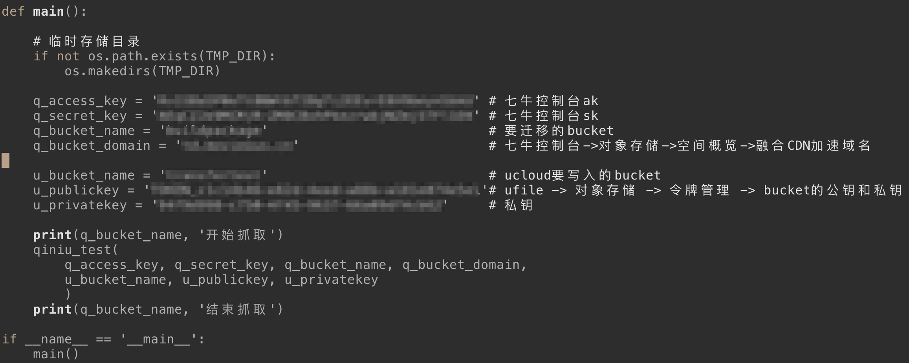

# KodoToUFile

对象存储迁移工具：七牛Kodo到UCloud UFile

## 使用方法

- shell执行 `pipenv install`，安装依赖的qiniu,ufile,requests,pickledb库
- 在main.py中，填写七牛和ucloud所需的key，见截图
- 最后在TodoToUFile目录下执行`run.sh`脚本,或`pipenv run python main.py` 网络异常未获取的文件，会写入.db文件中，以json格式存储

## 截图

